Data Analysis
================
Power Ninja Data Turtles
12.03.2019

### Load data and packages

``` r
library(tidyverse)
library(infer)
library(broom)

fight_songs <- read_csv("/cloud/project/data/fight-songs.csv")
fight_songs <- fight_songs %>%
  select(-X21)
```

### Research Question 1

Our first research question is:

> "How does the tempo and duration of a college football team’s fight
> song predict the content of the song, specifically the number of
> clichés/tropes?

Before we delve deeper into our analysis, let’s first take a look at the
distributions of our two explanatory variables, `bpm` and
`sec_duration`.

Starting with `bpm`, which is a measure of a fight song’s tempo, we will
create a histogram and find the relevant summary statistics:

``` r
ggplot(fight_songs, mapping = aes(x = bpm)) +
  geom_histogram(binwidth = 10) +
  labs(title = "Tempo of College Fight Songs",
       x = "Beats per Minute (bpm)",
       y = "Number of Songs")
```

<!-- -->

Let’s also calculate the summary statistics for this distribution.
Specifically, we will use the median as a measure of center and the
interquartile range as a measure of spread (due to the bimodal nature of
the distribution). In addition, we will find the upper and lower
quartiles (Q3 and Q1, respectively), and the maximum and minimum values:

``` r
fight_songs %>%
  summarise(min = min(bpm),
            Q1 = quantile(bpm, 0.25),
            median = median(bpm),
            Q3 = quantile(bpm, 0.75),
            max = max(bpm),
            IQR = IQR(bpm))
```

    ## # A tibble: 1 x 6
    ##     min    Q1 median    Q3   max   IQR
    ##   <dbl> <dbl>  <dbl> <dbl> <dbl> <dbl>
    ## 1    65    90    140   151   180    61

Based on the histogram, it is clear that the shape of the data is
clearly bimodal, with two distinct peaks occurring around 70 bpm and
around 150 bpm, with a split in the data at around 100 bpm. There are
more songs that are clustered around the higher bpm mode. The center
(median) occurs at 140 bpm, and the spread (IQR) is 61 bpm, indicating
that there is a moderate amount of variability in tempos. There are no
outliers in this distribution. Due to the bimodal result, it seems like
there is a natural grouping between “slow” songs and “fast” songs, so we
will use the `mutate()` function to add a new variable, `tempo`, which
is “slow” if a song’s `bpm` is less than or equal to 100 bpm and “fast”
if a song’s tempo is greater than 100 bpm.

``` r
fight_songs <- fight_songs %>%
  mutate(tempo = case_when(
    bpm <= 100 ~ "slow",
    bpm > 100 ~ "fast"
  ))
```

Now, let’s start exploring our second explanatory variable,
`sec_duration`, which is the duration of a song in seconds. In order to
do this, we will create a histogram of the distribution and find the
relevant summary statistics:

``` r
ggplot(fight_songs, mapping = aes(x = sec_duration)) +
  geom_histogram(binwidth = 20) +
  labs(title = "Duration of College Fight Songs",
       x = "Duration (sec)",
       y = "Number of Songs")
```

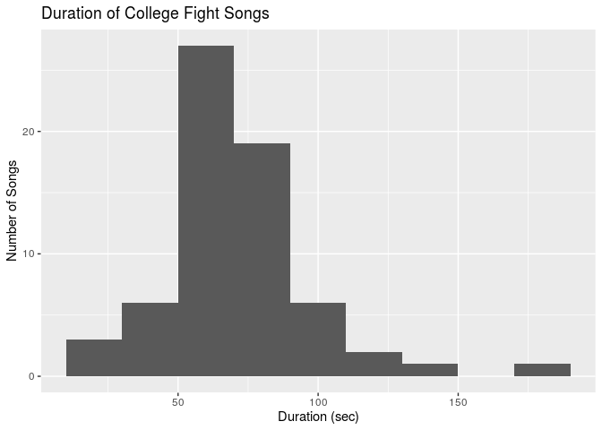<!-- -->

``` r
fight_songs %>%
  summarise(min = min(sec_duration),
            Q1 = quantile(sec_duration, 0.25),
            median = median(sec_duration),
            Q3 = quantile(sec_duration, 0.75),
            max = max(sec_duration),
            IQR = IQR(sec_duration))
```

    ## # A tibble: 1 x 6
    ##     min    Q1 median    Q3   max   IQR
    ##   <dbl> <dbl>  <dbl> <dbl> <dbl> <dbl>
    ## 1    27    58     67    85   172    27

Based on the histogram, we can see that the distribution of fight song
durations is roughly symmetric (slightly skewed to the right) and
unimodal, with a peak at around 70. There are some outliers on the
higher end of the spectrum (`sec_duration` \> 125.5), indicating that
these songs are significantly longer than the others. The center of the
distribution occurs at around 67 seconds, and the IQR of the
distribution is 27 seconds, which is relatively narrow, indicating that
fight songs do not have dramatically different lengths. Like we did with
`bpm`, let’s add a new variable, `length`, which is “short” if a song is
less than or equal to the median of 67 seconds and “long” if a song is
greater than the median of 67 seconds.

``` r
fight_songs <- fight_songs %>%
  mutate(length = case_when(
    sec_duration <= 67 ~ "short",
    sec_duration > 67 ~ "long"
  ))
```

Now that we have a better understanding of our two explanatory
variables, we want to add a new variable, `classify`, which combines
`bpm` and `sec_duration` by labeling each song with one of four
classifications: “slow and short”, “slow and long”, “fast and short”,
and “fast and long”:

``` r
fight_songs <- fight_songs %>%
  mutate(classify = case_when(
    tempo == "slow" & length == "short" ~ "slow and short",
    tempo == "slow" & length == "long" ~ "slow and long",
    tempo == "fast" & length == "short" ~ "fast and short",
    tempo == "fast" & length == "long" ~ "fast and long",
  ))

fight_songs %>%
  count(classify)
```

    ## # A tibble: 4 x 2
    ##   classify           n
    ##   <chr>          <int>
    ## 1 fast and long     23
    ## 2 fast and short    25
    ## 3 slow and long      9
    ## 4 slow and short     8

Based on the output displayed in the tibble above, 23 songs are
categorized as “fast and long”, 25 songs are categorized as “fast and
short”, 9 songs are categorized as “slow and long”, and 8 songs are
categorized as “slow and short”.

Using these classifications, let’s visualize the groups and fill in each
observation with the number of tropes associated with that particular
observation. We choose to use `geom_hline()` and `geom_vline()` to add
horizontal and vertical reference lines to the jittered plot
(`geom_jitter()` adds a small amount of random variation to the location
of each point). We also choose to use `scale_color_gradientn()` to
create a rainbow-colored gradient scale.

``` r
ggplot(fight_songs, mapping = aes(x = sec_duration, y = bpm)) +
  geom_jitter(aes(color = trope_count)) + 
  geom_hline(yintercept = 100, linetype = "dashed", color = "orange") +
  geom_vline(xintercept = 67, linetype = "dashed", color = "orange") +
  theme_minimal() +
  labs(title = "Classification of College Fight Songs", 
       subtitle = "By tempo and duration",
       x = "Duration (sec)",
       y = "Tempo (bpm)",
       color = "Number of Tropes") +
  scale_color_gradientn(colors = rainbow(5))
```

<!-- -->

The upper left-hand region of the plot represents songs that are “fast
and short” while the lower left-hand region represents songs that are
“slow and short.” The upper right-hand region of the plot represents
songs that are “fast and long”, and the lower right-hand region
represents songs that are “slow and long”.

Finally, let’s get an understanding of our response variable,
`trope_count`, which is a measure of the number of clichés/tropes in a
given fight song. We will also use a histogram and summary statistics
for this univariate analysis:

``` r
ggplot(fight_songs, mapping = aes(x = trope_count)) +
  geom_histogram(binwidth = 1) +
  labs(title = "Number of Clichés in College Fight Songs",
       x = "Number of Clichés",
       y = "Number of Songs")
```

<!-- -->

``` r
fight_songs %>%
  summarise(min = min(trope_count),
            Q1 = quantile(trope_count, 0.25),
            median = median(trope_count),
            Q3 = quantile(trope_count, 0.75),
            max = max(trope_count),
            IQR = IQR(trope_count),
            sd = sd(trope_count))
```

    ## # A tibble: 1 x 7
    ##     min    Q1 median    Q3   max   IQR    sd
    ##   <dbl> <dbl>  <dbl> <dbl> <dbl> <dbl> <dbl>
    ## 1     0     3      4     5     8     2  1.67

Based on the histogram and summary statistics, we can see that the
distribution for number of tropes is unimodal with a peak at around 4
and skewed slightly to the left. There is 1 outlier at the maximum value
of our distribution (8 tropes). The center of the distribution,
described by the median, is 4 tropes, and the IQR of 2 indicates that
there is not a large amount of variability in the number of tropes for
college fight songs.

Now, let’s return to our research question by examining whether the
amount of clichés varies based on a song’s classification. First, we
will create violin plots for the distribution of the number of tropes
for each classification and add jitter. Using jittered points allows us
to manage the effects of overplotting when working with smaller
datasets. We were inspired to use this type of plot after conferencing
with Dr. Eric Monson who delivered the “Tips for Effective Data
Visualization” presentation earlier this semester.

``` r
ggplot(fight_songs, mapping = aes(x = classify, y = trope_count)) +
  geom_violin(draw_quantiles = c(0.25, 0.50, 0.75)) +
  geom_jitter() +
  labs(title = "Number of Clichés",
       subtitle = "By Song Classification",
       x = "Song Classification",
       y = "Number of Clichés")
```

<!-- -->

``` r
fight_songs %>%
  group_by(classify) %>%
  summarize(median = median(trope_count), IQR = IQR(trope_count), sd = sd(trope_count))
```

    ## # A tibble: 4 x 4
    ##   classify       median   IQR    sd
    ##   <chr>           <dbl> <dbl> <dbl>
    ## 1 fast and long       4   2.5  1.73
    ## 2 fast and short      4   1    1.56
    ## 3 slow and long       5   2    2.28
    ## 4 slow and short      4   2    1.13

Not surprisingly, all of the distributions, except for “slow and long”,
are centered at 4 tropes, which is the median number of tropes for all
songs in the dataset. However, there is one category, “slow and long,”
which has a median of 5. We would like to check whether this median is
statistically significant or not. To do this, we will conduct a
hypothesis test for the median number of tropes for songs that are
considered “slow and long”. Our null hypothesis is that the true median
number of tropes for “slow and long” songs is 4, H0: median(“slow and
long”) = 4. Our alternative hypothesis is that the true median number of
tropes is different than 4, Ha: median(“slow and long”) ≠ 4. We will use
a significance (alpha) level of 0.05. Let’s create and visualize the
null distribution and calculate the associated p-value:

``` r
obs_median <- 5 # From summary statistics in previous code chunk

slow_long <- fight_songs %>%
  filter(classify == "slow and long")

set.seed(11101962)
null_slow_long <- slow_long %>%
  specify(response = trope_count) %>%
  hypothesize(null = "point", med = 4) %>%
  generate(reps = 1000, type = "bootstrap") %>%
  calculate(stat = "median")

get_p_value(null_slow_long, obs_stat = obs_median, direction = "two_sided")
```

    ## # A tibble: 1 x 1
    ##   p_value
    ##     <dbl>
    ## 1   0.038

``` r
visualise(null_slow_long) + 
  labs(title = "Null Distribution for Median Number of Tropes",
       subtitle = "For Slow and Long Fight Songs",
       x = "Sample Median Number of Tropes",
       y = "Count") +
  shade_p_value(obs_stat = obs_median, direction = "two_sided")
```

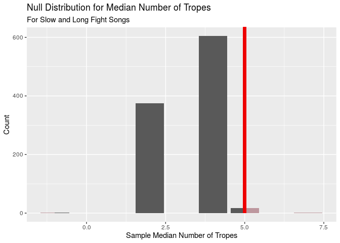<!-- -->

Based on our p-value of 0.038, which is less than 0.05 (significance
level), we reject the null hypothesis in favor of the alternative
hypothesis; in other words, there is sufficient evidence that the true
median number of tropes is different than 4. Thus, the data provide
convincing evidence that the median number of tropes for songs that are
slow and long is different than the population median of 4. However, our
sample size is very small (9 observations), so we must be wary of our
results and acknowledge the limitations of our conclusions.

We can also see from the visualization “Number of Clichés” that the
spread for “slow and short” songs is much smaller compared to all other
song classifications. We will test whether the standard deviation for
“slow and short” songs is significantly different from the population
standard deviation of 1.675.

The null hypothesis is that the true standard deviation in the number of
tropes for “slow and short” songs is 1.675, H0: sigma = 1.675.

The alternative hypothesis is that the true standard deviation in the
number of tropes for “slow and short” songs is less than 1.675, Ha:
sigma \< 1.675. We will use a significance level of 0.05.

``` r
obs_sd <- 1.13 # From summary statistics in previous code chunk

slow_short <- fight_songs %>%
  filter(classify == "slow and short")

set.seed(11101962)
null_slow_short <- slow_short %>%
  specify(response = trope_count) %>%
  hypothesize(null = "point", sigma = 1.675) %>%
  generate(reps = 1000, type = "bootstrap") %>%
  calculate(stat = "sd")

get_p_value(null_slow_short, obs_stat = obs_sd, direction = "left")
```

    ## # A tibble: 1 x 1
    ##   p_value
    ##     <dbl>
    ## 1   0.685

``` r
visualise(null_slow_short) + 
  labs(title = "Null Distribution for Standard Deviation of Tropes",
       subtitle = "For Slow and Short Fight Songs",
       x = "Sample Standard Deviation of Tropes",
       y = "Count") +
  shade_p_value(obs_sd, direction = "left")
```

<!-- -->

Based on the p-value of 0.685, which is greater than our alpha level of
0.05, we fail to reject the null hypothesis in favor of the alternative
hypothesis; in other words, the data do not provide convincing evidence
that the true standard deviation for slow and short songs is less than
the population standard deviation of 1.675.

Now, let’s find the full linear model that predicts number of tropes
(`trope_count`) from tempo (`bpm`) and duration (`sec_duration`):

``` r
(m_full <- lm(trope_count ~ bpm + sec_duration, data = fight_songs)) %>%
  tidy() %>%
  select(term, estimate)
```

    ## # A tibble: 3 x 2
    ##   term          estimate
    ##   <chr>            <dbl>
    ## 1 (Intercept)   4.58    
    ## 2 bpm          -0.00757 
    ## 3 sec_duration  0.000208

``` r
glance(m_full)$AIC
```

    ## [1] 256.96

``` r
glance(m_full)$r.squared
```

    ## [1] 0.02260804

Based on the output, the full linear model is `trope_count-hat` = 4.58 -
0.00757 \* `bpm` + 0.000208 \* `sec_duration`. The R-squared value is
0.022608, which means that approximately 2.2608044% of the variability
in trope counts can be explained by the linear model that predicts trope
count from a song’s tempo and duration. Given this R-squared value, our
model is very weak, since, in general, the closer the R-squared value is
to 1 (100% of the variability in trope counts can be explained by the
model), the more accurate and useful the final model is. As the model
only accounts for a small percent of the variability in trope counts, it
is not a great predictor of a fight song’s trope count.

The intercept tells us that for a song with 0 bpm which lasts 0 seconds,
the expected number of tropes is 4.58. But of course, this is
nonsensical, since none of the fight songs we are considering in our
analysis last 0 seconds (for that matter, no songs, by definition, last
0 seconds\!). The slope coefficient associated with `bpm` tells us that
for an increase in 1 bpm, the number of tropes is expected, on average,
to decrease by 0.00757, holding all else constant. The slope coefficient
associated with `sec_duration` tells us that for an increase in a song’s
duration by 1 second, the number of tropes is expected, on average, to
increase by 0.000208, holding all else constant.

Now, we will conduct a hypothesis test for the slopes to determine
whether the slope coefficients for `bpm` and `sec_duration` are
significantly different from 0. We will use a significance level of
0.05. Conducting a hypothesis test for the slopes will help us confirm
or deny our research question on whether either tempo or duration are
useful predictors of the content of a fight song, as determined by a
song’s number of tropes.

Let our null hypotheses be that the slope coefficients associated with
both variables are 0; H0: beta(`bpm`) = 0 and beta(`sec_duration`) = 0.

Let our alternative hypotheses be that the slope coefficients associated
with both variables are significantly different than 0, Ha: beta(`bpm`)
≠ 0 and beta(`sec_duration`) ≠ 0.

``` r
obs_beta_bpm <- tidy(m_full) %>%
  select(estimate) %>% 
  slice(2) %>% 
  pull() 

set.seed(11101962)
null_dist_bpm_slope <- fight_songs %>%
  specify(response = trope_count, explanatory = bpm) %>%
  hypothesize(null = "independence") %>%
  generate(reps = 1000, type = "permute") %>%
  calculate(stat = "slope")

get_p_value(null_dist_bpm_slope, obs_stat = obs_beta_bpm, direction = "two_sided")
```

    ## # A tibble: 1 x 1
    ##   p_value
    ##     <dbl>
    ## 1   0.238

``` r
visualise(null_dist_bpm_slope) + 
  labs(title = "Null Distribution for Tempo Slope Coefficient",
       subtitle = "In full linear model for trope count",
       x = "Sample bpm Slope Coefficients",
       y = "Count") +
  shade_p_value(obs_beta_bpm, direction = "two_sided")
```

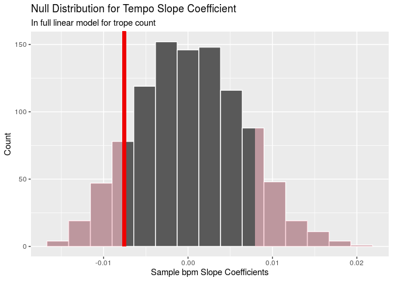<!-- -->

``` r
obs_beta_sec_duration <- tidy(m_full) %>% 
  select(estimate) %>% 
  slice(3) %>%
  pull() 

set.seed(11101962)
null_dist_sec_duration_slope <- fight_songs %>%
  specify(response = trope_count, explanatory = sec_duration) %>%
  hypothesize(null = "independence") %>%
  generate(reps = 1000, type = "permute") %>%
  calculate(stat = "slope")

get_p_value(null_dist_sec_duration_slope, obs_stat = obs_beta_sec_duration, direction = "two_sided")
```

    ## # A tibble: 1 x 1
    ##   p_value
    ##     <dbl>
    ## 1   0.978

``` r
visualise(null_dist_sec_duration_slope) + 
  labs(title = "Null Distribution for Song Duration Slope Coefficient",
       subtitle = "In full linear model for trope count",
       x = "Sample Song Duration Slope Coefficients",
       y = "Count") +
  shade_p_value(obs_beta_sec_duration, direction = "two_sided")
```

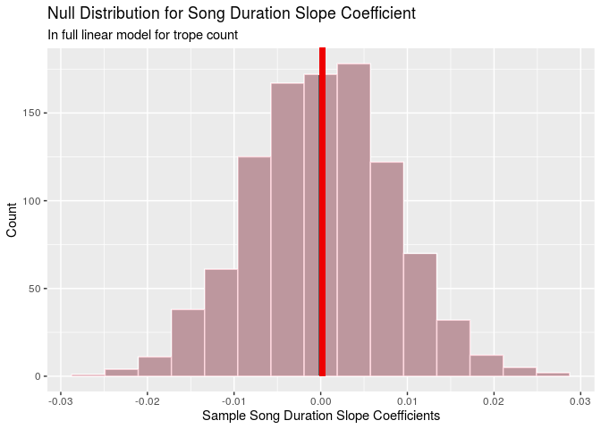<!-- -->

The p-values for the slope coefficients of `bpm` and `sec_duration` are
0.238 and 0.978, respectively. Since both p-values are greater than our
alpha level of 0.05, we should fail to reject the null hypotheses in
favor of the alternative hypotheses. Hence, there appears to be
insufficient evidence that the slope coefficients for `bpm` and
`sec_duration` are different than 0.

However, we must must verify that the four conditions for inference for
regression are satisfied before finalizing any conclusions: (1)
observations should be independent; (2) residuals should be randomly
distributed around 0; (3) residuals should be nearly normally
distributed, centered at 0; (4) residuals should have constant variance.

First, we can assume that the observations (fight songs) are independent
because college fight songs are unique to every team and written by
different authors.

Next, we will verify our assumption (confirm independence of
observations) by plotting the residuals in the order of data collection:

``` r
m_full_aug <- augment(m_full)
ggplot(data = m_full_aug, aes(x = 1:nrow(m_full_aug), y = .resid)) +
  geom_point() +
  labs(title = "Residual Plot by Index",
       subtitle = "In the order of data collection",
       x = "Index",
       y = "Residual")
```

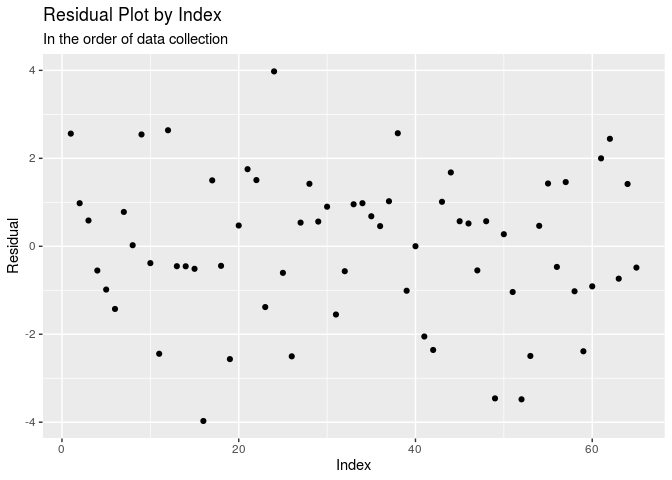<!-- -->

Next, let’s examine the normality of residuals:

``` r
ggplot(data = m_full_aug, aes(x = .resid)) +
  geom_histogram(binwidth = 1.25) +
  labs(title = "Normality of Residuals",
       x = "Residuals")
```

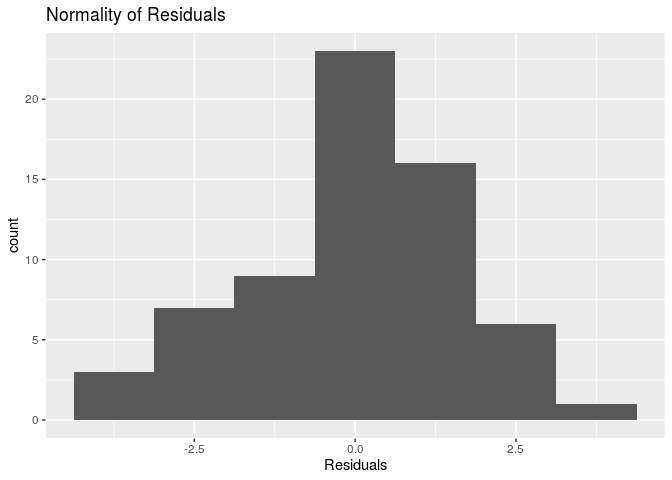<!-- -->

Finally, we will check the distribution of residuals around 0 and
constant variance:

``` r
ggplot(data = m_full_aug, aes(x = .fitted, y = .resid)) +
  geom_point() +
  geom_hline(yintercept = 0, lty = 3, color = "blue") +
  labs(title = "Distribution of Residuals",
       x = "Predicted values, y-hat",
       y = "Residuals")
```

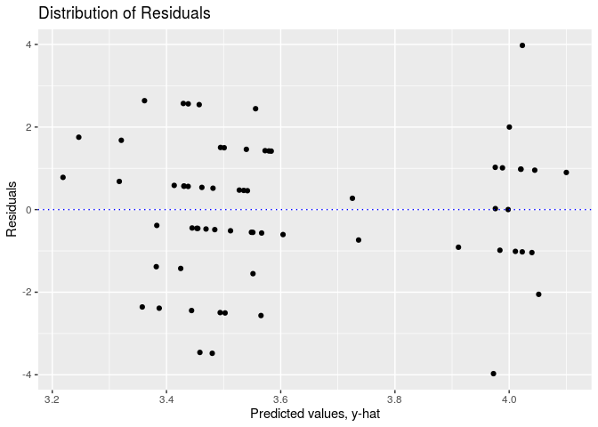<!-- -->

Clearly, condition 4 (constant variance) is violated. Therefore,
inference for regression is invalid. This means our conclusion that
there is insufficient evidence to suggest the slope coefficients for
`bpm` and `sec_duration` are different than 0 is also not credible.

To confirm that there is no better linear model, we will use the
`step()` function and backwards selection with AIC as the selection
criterion:

``` r
(m_trope_count <- step(m_full, direction = "backward")) 
```

``` r
m_trope_count %>%
  tidy() %>%
  select(term, estimate)
```

    ## # A tibble: 1 x 2
    ##   term        estimate
    ##   <chr>          <dbl>
    ## 1 (Intercept)     3.62

``` r
glance(m_trope_count)$AIC
```

    ## [1] 254.4464

Since backwards selection removed both `bpm` and `sec_duration` from our
model, we should conclude that these two variables are not valid
predictors for the number of tropes in a college fight song.

However, we must consider one last element before concluding that `bpm`
and `sec_duration` are poor predictors of `trope_count`: whether the
requirements for linear regression are satisfied. Amongst other things,
a linear model mandates a continuous numerical response variable\! But,
it is clear that `trope_count` does not fulfill this criterion since it
is a counting (discrete) numerical response variable. Thus, our final
conclusions are as follows: this method of analysis involving linear
regression is invalid and there is no guarantee that the explanatory
variables are poor predictors of the response variable.

Circling back to our research question, it appears as though we have
insufficient evidence to describe the correlation (if any) between our
two explanatory variables, `bpm` and `sec_duration`, and the trope count
for a given fight song. The only evidence that we have is that “slow and
long” fight songs have a different median number of tropes than other
fight songs.

### Research Question 2

Our second research question is:

> "How do characteristics of the fight songs of college football teams
> correspond to their respective historical levels of success
> (rankings)?

Before we delve deeper into our analysis, let’s first take a look at the
distributions of our four explanatory variables, `victory_win_won`,
`opponents`, `nonsense`, and `rah`, and our response variable, `rank`.

We will begin our analysis with `victory_win_won`, which designates
whether a fight song says “victory”, “win”, or “won”, by creating a bar
graph:

``` r
ggplot(fight_songs, mapping = aes(x = victory_win_won)) +
  geom_bar() +
  labs(title = "Distribution of Whether Fight Songs Include 'victory', 'win', or 'won'",
       x = "Whether Fight Song Includes 'victory', 'win', or 'won'",
       y = "Number of College Football Teams")
```

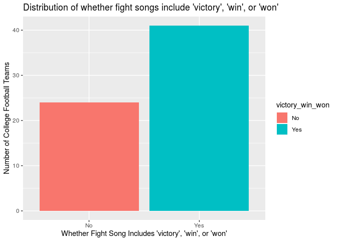<!-- -->

Next, we will look at `opponents`, which designates whether a song
mentions an opponent, by creating a bar graph:

``` r
ggplot(fight_songs, mapping = aes(x = opponents)) +
  geom_bar() +
  labs(title = "Distribution of Whether Fight Songs Include Opponents",
       x = "Whether Fight Song Includes Opponents",
       y = "Number of College Football Teams")
```

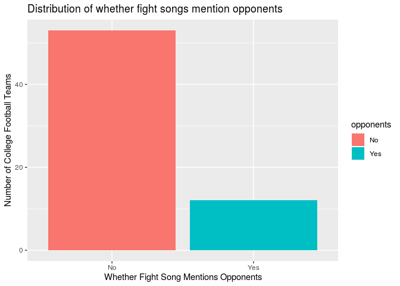<!-- -->

Now, we will explore `nonsense`, which designates whether a song
includes any nonsense words/phrases, by creating a bar graph:

``` r
ggplot(fight_songs, mapping = aes(x = nonsense)) +
  geom_bar() +
  labs(title = "Distribution of Whether Fight Songs Include Nonsense",
       x = "Whether Fight Song Includes Nonsense Words",
       y = "Number of College Football Teams")
```

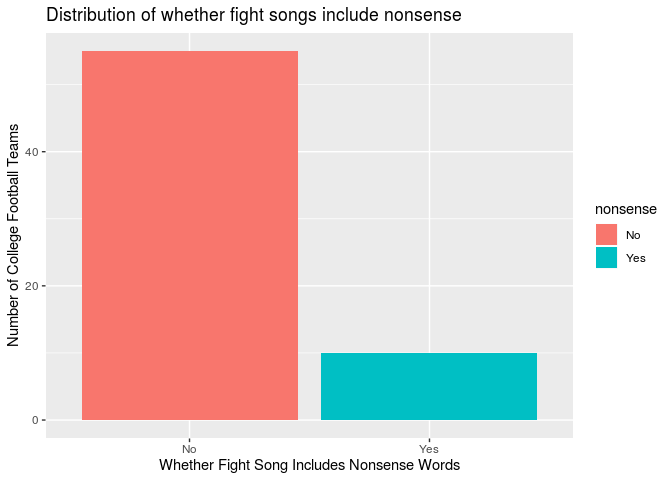<!-- -->

Then, we will examine `rah`, which designates whether a fight song says
the word “rah”, by creating a bar graph:

``` r
ggplot(fight_songs, mapping = aes(x = rah)) +
  geom_bar() +
  labs(title = "Distribution of Whether Fight Songs Include 'rah'",
       x = "Whether Fight Song Includes 'rah'",
       y = "Number of College Football Teams")
```

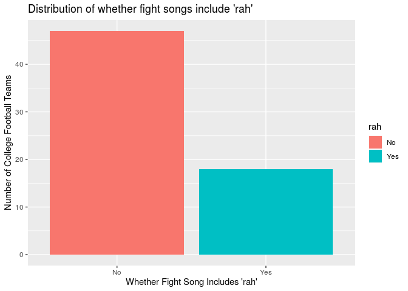<!-- -->

Finally, we will look at `rank`, which corresponds to the team’s AP
college football ranking. We will create a histogram and calculate the
appropriate summary statistics:

``` r
ggplot(fight_songs, mapping = aes(x = rank)) +
  geom_histogram(bins = 10) +
  labs(title = "Distribution of College Football Rankings",
       x = "Rank",
       y = "Number of College Football Teams")
```

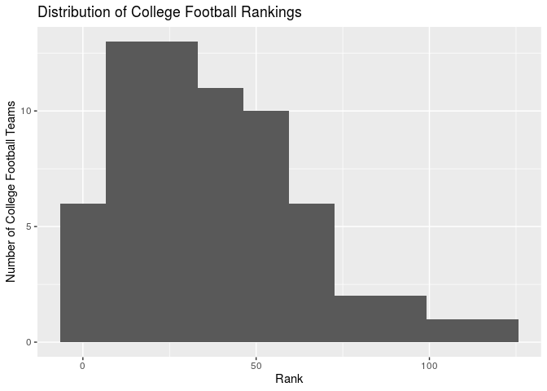<!-- -->

In calculating the summary statistics for `rank`, we will use the median
as a measure of center and the interquartile range as a measure of
spread (due to the skewed nature of the distribution). In addition, we
will find the upper and lower quartiles (Q3 and Q1, respectively), and
the maximum and minimum values:

``` r
fight_songs %>%
  summarise(min = min(rank), Q1 = quantile(rank, 0.25),
            median = median(rank), Q3 = quantile(rank,
                                                 0.75),
            max = max(rank), IQR = IQR(rank))
```

    ## # A tibble: 1 x 6
    ##     min    Q1 median    Q3   max   IQR
    ##   <dbl> <dbl>  <dbl> <dbl> <dbl> <dbl>
    ## 1     1    17     34    55   120    38

Based on the histogram, it is clear that the shape of the data is
unimodal. The distribution is skewed to the right, with more colleges
having higher ranked teams than lower ranked teams. The center (median)
occurs at 34, and the spread (IQR) is 38, indicating that there is a
moderate amount of variability in rankings. There is one outlier (a
college football team ranked higher than 112) with a rank of 120.

We hypothesize that a statistically significant relationship exists
between `victory_win_won` and `rank` because it is reasonable to asssume
historically successful college football teams would incorporate
symbolic elements of their dominance into their iconic fight songs. In
this case, we believe the words “victory”, “win”, and “won” are symbolic
elements of dominance, giving us reason to believe higher-ranked teams
are more likely to have their fights songs include these words.

First, I will find the median rankings based on `victory_win_won` (yes
or no):

``` r
fight_songs %>%
  group_by(victory_win_won) %>%
  summarise(med_rank = median(rank))
```

    ## # A tibble: 2 x 2
    ##   victory_win_won med_rank
    ##   <chr>              <dbl>
    ## 1 No                  37.5
    ## 2 Yes                 32

I observe a difference of 5.5 (37.5 - 32.0) in rank between colleges
with and without “victory”, “win”, or “won” in their fight songs.

The null hypothesis is that there is no difference in the median
rankings of college football teams between those with and without
“victory”, “win”, or “won” in their fight songs; H0:
mu(victory\_win\_wonNo) - mu(victory\_win\_wonYes) = 0.

The alternative hypothesis is that there is a difference in the median
rankings of college football teams between those with and without
“victory”, “win”, or “won” in their fight songs; H0:
mu(victory\_win\_wonNo) - mu(victory\_win\_wonYes) ≠ 0.

Now, I will run a hypothesis test, calculate the p-value, and interpret
the results in order to determine whether there is a statistically
significant difference in the median rankings of college football teams
who include “victory”, “win”, or “won” in their fight songs and those
who do not:

``` r
obs_diff_victory_win_won <- 5.5 # From above code chunk

set.seed(11101962)
null_dist_victory_win_won <- fight_songs %>%
  specify(response = rank, explanatory = victory_win_won) %>%
  hypothesize(null = "independence") %>% 
  generate(reps = 1000, type = "permute") %>%
  calculate(stat = "diff in medians", 
            order = c("No", "Yes"))

get_p_value(null_dist_victory_win_won, obs_stat = obs_diff_victory_win_won, direction = "two_sided")
```

    ## # A tibble: 1 x 1
    ##   p_value
    ##     <dbl>
    ## 1   0.634

``` r
visualise(null_dist_victory_win_won) + 
  labs(title = "Null Distribution for Median Rankings of College Football Teams",
       subtitle = "For fight songs which include 'victory', 'win', or 'won'",
       x = "Sample Median Ranking",
       y = "Count") +
  shade_p_value(obs_stat = obs_diff_victory_win_won, direction = "two_sided")
```

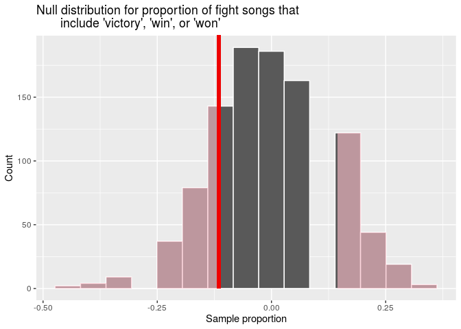<!-- -->

Since the p-value, 0.634, is greater than our significance level of
0.05, we fail to reject the null hypothesis in favor of the alternative
hypothesis. In other words, the data do not provide convincing evidence
of a difference in the median rankings of college football teams based
on whether or not their fight songs include the words “victory”, “win”,
or “won”. Thus, our original hypothesis was incorrect.

We also hypothesize that a statistically significant relationship exists
between `opponents` and `rank` since higher-ranked college football
teams are likely to have developed more emotionally-charged rivalries
with their highly successful peers. With such long-standing, emotional
rivalries, it is reasonable to believe fight songs associated with these
highly-ranked college football programs allude to their rivals by name.

First, I will find the median rankings based on `opponents` (yes or no):

``` r
fight_songs %>%
  group_by(opponents) %>%
  summarise(med_rank = median(rank))
```

    ## # A tibble: 2 x 2
    ##   opponents med_rank
    ##   <chr>        <dbl>
    ## 1 No            34  
    ## 2 Yes           34.5

I observe a difference of 0.5 (34.5 - 34.0) in rank between colleges
that do and do not mention opponents in their fight songs.

The null hypothesis is that there is no difference in the median
rankings of college football teams between those who do and do not
mention their opponents in their fight songs; H0: mu(opponentsNo) -
mu(opponentsYes) = 0.

The alternative hypothesis is that there is a difference in the median
rankings of college football teams between those who do and do not
mention their opponents in their fight songs; H0: mu(opponentsNo) -
mu(opponentsYes) ≠ 0.

Now, I will run a hypothesis test, calculate the p-value, and interpret
the results in order to determine whether there is a statistically
significant difference in the median rankings of college football teams
who mention their opponents in their respective fight songs and those
who do not:

``` r
obs_diff_opponents <- 0.5 # From above code chunk

set.seed(11101962)
null_dist_opponents <- fight_songs %>%
  specify(response = rank, explanatory = opponents) %>%
  hypothesize(null = "independence") %>% 
  generate(reps = 1000, type = "permute") %>%
  calculate(stat = "diff in medians", 
            order = c("Yes", "No"))

get_p_value(null_dist_opponents, obs_stat = obs_diff_opponents, direction = "two_sided")
```

    ## # A tibble: 1 x 1
    ##   p_value
    ##     <dbl>
    ## 1       1

``` r
visualise(null_dist_opponents) + 
  labs(title = "Null Distribution for Median Rankings of College Football Teams",
       subtitle = "For fight songs which mention opponents",
       x = "Sample Median Ranking",
       y = "Count") +
  shade_p_value(obs_stat = obs_diff_opponents, direction = "two_sided")
```

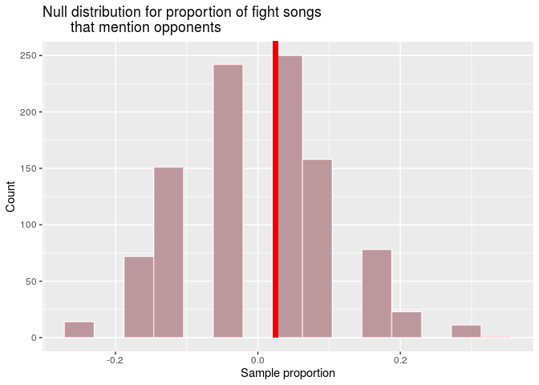<!-- -->

Since the p-value, 1, is greater than our alpha level of 0.05, we fail
to reject the null hypothesis in favor of the alternative hypothesis. In
other words, the data do not provide convincing evidence of a difference
in the median rankings of college football teams based on whether or not
their fight songs mention opponents. Thus, our original hypothesis was
incorrect.

Moreover, we hypothesize that a statistically significant relationship
exists between `nonsense` and `rank` because there have been a plethora
of articles written about how, in the past, highly successful teams
included nonsensical phrases in their fight songs to distract the
players on opposing college football teams. Since the fight songs
included in our dataset were written decades ago (as evidenced by the
`year` variable), it is reasonable to assume the songs associated with
the historically-best college teams will have a higher likelihood of
including nonsense (e.g “Hooperay”).

First, I will find the median rankings based on `nonsense` (yes or no):

``` r
fight_songs %>%
  group_by(nonsense) %>%
  summarise(med_rank = median(rank))
```

    ## # A tibble: 2 x 2
    ##   nonsense med_rank
    ##   <chr>       <dbl>
    ## 1 No           31  
    ## 2 Yes          42.5

I observe a difference of 11.5 (42.5 - 31) in rank between colleges with
and without nonsense words in their fight songs.

The null hypothesis is that there is no difference in the median
rankings of college football teams between those with and without
nonsense words in their fight songs: H0 = mu(nonsenseNo) -
mu(nonsenseYes) = 0.

The alternative hypothesis is that there is a difference in the median
rankings of college football teams between those with and without
nonsense words in their fight songs: H0 = mu(nonsenseNo) -
mu(nonsenseYes) ≠ 0.

Now, I will run a hypothesis test, calculate the p-value, and interpret
the results in order to determine whether there is a statistically
significant difference in median rank between colleges with/without
nonsense words in their fight songs:

``` r
obs_diff_nonsense <- 11.5 # From above code chunk

set.seed(11101962)
null_dist_nonsense <- fight_songs %>%
  specify(response = rank, explanatory = nonsense) %>%
  hypothesize(null = "independence") %>% 
  generate(reps = 1000, type = "permute") %>%
  calculate(stat = "diff in medians", 
            order = c("Yes", "No"))

get_p_value(null_dist_nonsense, obs_stat = obs_diff_nonsense, direction = "two_sided")
```

    ## # A tibble: 1 x 1
    ##   p_value
    ##     <dbl>
    ## 1   0.344

``` r
visualise(null_dist_nonsense) + 
  labs(title = "Null Distribution for Median Rankings of College Football Teams",
       subtitle = "For fight songs which include nonsensical phrases",
       x = "Sample Median Ranking",
       y = "Count") +
  shade_p_value(obs_stat = obs_diff_nonsense, direction = "two_sided")
```

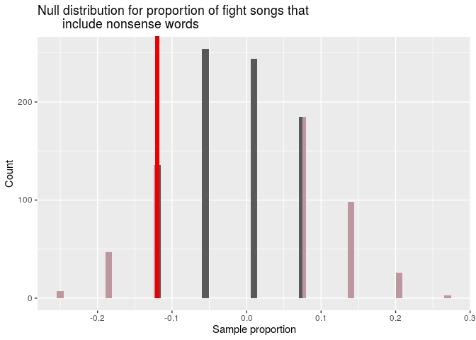<!-- -->

Since the p-value, 0.344, is greater than our alpha level of 0.05, we
fail to reject the null hypothesis in favor of the alternative
hypothesis. In other words, the data do not provide convincing evidence
of a difference in the median rankings of college football teams based
on whether or not their fight songs include nonsense words. Thus, our
original hypothesis was incorrect.

Finally, we hypothesize that there is no statistically significant
relationship between `rah` and `rank` since “rah” seems like it would be
a common word in a fight song, irrespective of the quality (how
successful) of a college football team.

First, I will find the median rankings based on `rah` (yes or no):

``` r
fight_songs %>%
  group_by(rah) %>%
  summarise(med_rank = median(rank))
```

    ## # A tibble: 2 x 2
    ##   rah   med_rank
    ##   <chr>    <dbl>
    ## 1 No        32  
    ## 2 Yes       37.5

I observe a difference of 5.5 (37.5 - 32.0) in rank between colleges
with and without “rah” in their fight songs.

The null hypothesis is that there is no difference in the median
rankings of college football teams between those with and without “rah”
in their fight songs; H0: mu(rahNo) - mu(rahYes) = 0.

The alternative hypothesis is that there is a difference in the median
rankings of college football teams between those with and without “rah”
in their fight songs: Ha = mu(rahNo) - mu(rahYes) ≠ 0.

Now, I will run a hypothesis test, calculate the p-value, and interpret
the results in order to determine whether there is a statistically
significant difference in median rankings between colleges with/without
“rah” in their fight songs:

``` r
obs_diff_rah <- 5.5 # From above code chunk

set.seed(11101962)
null_dist_rah <- fight_songs %>%
  specify(response = rank, explanatory = rah) %>%
  hypothesize(null = "independence") %>% 
  generate(reps = 1000, type = "permute") %>%
  calculate(stat = "diff in medians", 
            order = c("Yes", "No"))

get_p_value(null_dist_rah, obs_stat = obs_diff_rah, direction = "two_sided")
```

    ## # A tibble: 1 x 1
    ##   p_value
    ##     <dbl>
    ## 1   0.678

``` r
visualise(null_dist_rah) + 
  labs(title = "Null Distribution for Median Rankings of College Football Teams",
       subtitle = "For fight songs which include 'rah'",
       x = "Sample Median Ranking",
       y = "Count") +
  shade_p_value(obs_stat = obs_diff_rah, direction = "two_sided")
```

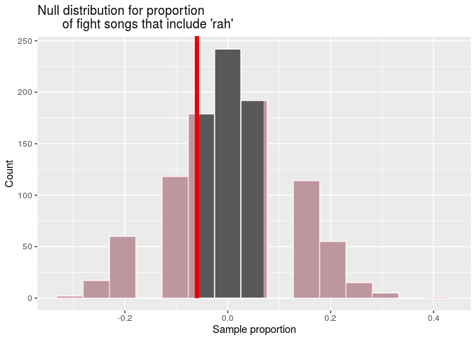<!-- -->

Since the p-value, 0.678, is greater than our significance level of
0.05, we fail to reject the null hypothesis. In other words, the data do
not provide convincing evidence of a difference in the median rankings
of college football teams based on whether or not their fight songs
include “rah”. Therefore, our original hypothesis was correct.

Now, let’s find the full linear model that predicts the rank of a
college football team (`rank`) based on various characteristics of the
college’s fight song: `victory_win_won`, `opponents`, `nonsense`, and
`rah` and calculate the R-squared value for this
model:

``` r
(m_rank_full <- lm(rank ~ victory_win_won + opponents + nonsense + rah, data = fight_songs)) %>%
  tidy() %>%
  select(term, estimate)
```

    ## # A tibble: 5 x 2
    ##   term               estimate
    ##   <chr>                 <dbl>
    ## 1 (Intercept)           39.0 
    ## 2 victory_win_wonYes    -6.25
    ## 3 opponentsYes          -5.56
    ## 4 nonsenseYes           10.6 
    ## 5 rahYes                 6.80

``` r
glance(m_rank_full)$AIC
```

    ## [1] 615.9821

``` r
glance(m_rank_full)$r.squared
```

    ## [1] 0.06228747

Based on the output, the full linear model is `rank-hat` = 39.0 - 6.25
\* `victory_win_wonYes` - 5.56 \* `opponentsYes` + 10.6 \*
`nonsenseYes`+ 6.80 \* `rahYes`. The R-squared value is 0.0622875, which
means that approximately 6.2287474% of the variability in rank can be
accounted for by the model. Given this R-squared value, the model is
very weak since, in general, the closer the R-squared value is to 1
(100% of the variability in rankings can be explained by the model), the
more accurate and useful the final model is. As the model only accounts
for a small percent of the variability in rank, it is not a great
predictor of a college football team’s ranking.

The intercept tells us that for a college with “No” responses for
`victory_win_won`, `opponents`, `nonsense`, and `rah`, the expected
ranking of the school’s football team is 39.0. The slope coefficient
associated with `victory_win_wonYes` tells us that, if a fight song
includes the words “victory”, “win”, or “won”, the ranking of the
football team is expected, on average, to decrease by 6.25, holding all
else constant. The slope coefficient associated with `opponentsYes`
tells us that, if a fight song mentions the college’s opponent, the
ranking of the football team is expected, on average, to decrease by
5.56, holding all else constant. The slope coefficient associated with
`nonsenseYes` tells us that, if a fight song includes any nonsense
words, the ranking of the football team is expected, on average, to
increase by 10.6, holding all else constant. The slope coefficient
associated with `rahYes` tells us that, if a fight song includes the
word “rah”, the ranking of the football team is expected, on average, to
increase by 6.80, holding all else constant.

To confirm that there is no better model, we will use the `step()`
function and backwards selection with AIC as the selection criterion:

``` r
best_rank_model <- step(m_rank_full, direction = "backward")
```

``` r
best_rank_model %>%
  tidy() %>%
  select(term, estimate)
```

    ## # A tibble: 1 x 2
    ##   term        estimate
    ##   <chr>          <dbl>
    ## 1 (Intercept)     37.6

``` r
glance(best_rank_model)$AIC
```

    ## [1] 612.1624

Since backwards selection removed `victory_win_won`, `opponents`,
`nonsense`, and `rah` from our model, we should conclude that these four
variables are poor predictors for the ranking of a college football
team.

However, we must consider one last element before concluding that
`victory_win_won`, `opponents`, `nonsense`, and `rah` are poor
predictors of `rank`: whether the requirements for linear regression are
satisfied. Amongst other things, a linear model mandates a continuous
numerical response variable\! But, it is clear that `rank` does not
fulfill this criterion since it is a counting (discrete) numerical
response variable. Thus, our final conclusions are as follows: this
method of analysis involving linear regression is invalid and there is
no guarantee that the explanatory variables are poor predictors of the
response variable.

## Additional Analysis

For the last part of our analysis, we are interested in examining
whether certain characteristics of fight songs are regionally unique. In
particular, we are interested in looking at the variables
`victory_win_won`, whether a song includes the words “victory”, “win”,
or "won, `men`, whether a song refers to male groups (fathers, sons,
men, etc.), and `nonsense`, whether a song uses nonsense syllables, to
see whether northern schools (conferences) are more or less likely to
have fight songs with these characteristics.

First, we will add a new variable to the `fight_songs` dataset called
`region`, which will represent the region of the United States that a
given college is located based on its conference – north or south. Since
Notre Dame is the only college we will consider in the analysis that is
independent (not in a conference), we will encode it to a region on its
own (north). It should also be noted that the PAC-12 and ACC conferences
are considered western and eastern conferences, respectively, but for
the purpose of our analysis, we will label them as northern and
southern, respectively, because we are interested in the characteristics
of fight songs for conferences in the north vs. south. Exactly half of
the teams in the PAC-12 conference are, indeed, northern schools, while
the majority of schools in the ACC conference are southern.

``` r
fight_songs <- fight_songs %>%
  mutate(region = case_when(
    conference == "SEC" ~ "south",
    conference == "Pac-12" ~ "north",
    conference == "Big 12" ~ "south",
    conference == "ACC" ~ "south",
    conference == "Big Ten" ~ "north",
    school == "Notre Dame" ~ "north"
  ))

fight_songs %>%
  count(region)
```

    ## # A tibble: 2 x 2
    ##   region     n
    ##   <chr>  <int>
    ## 1 north     27
    ## 2 south     38

There are 27 schools that we are considering to be in the northern
region and 38 in the southern region.

Let’s look at our first variable, `victory_win_won` to see whether there
exists a statistically significant relationship between the proportion
of teams for which `victory_win_won` is “yes” for northern or southern
conferences. First, let’s find what the two proportions are.

``` r
fight_songs %>%
  count(region, victory_win_won) %>%
  group_by(region) %>%
  mutate(prop_victory_win_won_yes = n/sum(n))
```

    ## # A tibble: 4 x 4
    ## # Groups:   region [2]
    ##   region victory_win_won     n prop_victory_win_won_yes
    ##   <chr>  <chr>           <int>                    <dbl>
    ## 1 north  No                  8                    0.296
    ## 2 north  Yes                19                    0.704
    ## 3 south  No                 16                    0.421
    ## 4 south  Yes                22                    0.579

Based on the output, 70.4% of schools in northern conferences have the
words “victory,” “win,” or “won” in their fight songs. On the other
hand, only 57.9% of schools in southern conferences have the words
“victory,” “win,” or “won” in their fight songs. We would like to see
if this result is statistically significant and what the true difference
in proportions is. We have to use simulation-based hypothesis testing
because we are looking for the difference in proportions.

First, we will run a hypothesis test, calculate the p-value, and
interpret the results in order to determine whether there is a
statistically significant difference in the proportion of fight songs
that say “victory,” “win,” or “won” for schools in northern vs. southern
conferences. Our null hypothesis is that there is no difference in the
proportion of schools that say “victory,” “win,” or “won” in their fight
songs for southern and northern conferences, H0: p(southern) =
p(northern). Our alternative hypothesis is that there is a difference in
the proportion of schools that say “victory,” “win,” or “won” in their
fight songs for southern and northern conferences, Ha: p(southern) ≠
p(northern). We will use a significance level of
0.05.

``` r
obs_diff_props_n_s_victory <- 0.7037037 - 0.5789474 # From above code chunk

set.seed(11101962)
null_dist_north_south_victory <- fight_songs %>%
  specify(response = victory_win_won, explanatory = region, success = "Yes") %>%
  hypothesize(null = "independence") %>% 
  generate(reps = 1000, type = "permute") %>%
  calculate(stat = "diff in props", order = c("north", "south"))

get_p_value(null_dist_north_south_victory, obs_stat = obs_diff_props_n_s_victory, direction = "two_sided")
```

    ## # A tibble: 1 x 1
    ##   p_value
    ##     <dbl>
    ## 1   0.418

``` r
visualise(null_dist_north_south_victory) + 
  labs(title = "Null Distribution for Difference in Proportions of Fight Songs that Include 'Victory', 'Win', or 'Won'",
       subtitle = "For colleges located in the north and south",
       x = "Sample Difference in Proportions",
       y = "Count") +
  shade_p_value(obs_stat = obs_diff_props_n_s_victory, direction = "two_sided")
```

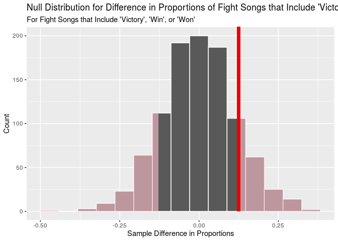<!-- -->

Based on our p-value of 0.418, which is greater than our significance
level of 0.05, we fail to reject the null hypothesis. There is
insufficient evidence that there is a difference in the proportion of
fight songs that include “victory,” “win,” or “won” for southern and
northern conferences.

However, we did observe that northern conferences had a greater
proportion of teams with fight songs for which `victory_win_won` was
“yes.” Therefore, let’s create a confidence interval to find what the
true difference in proportions really is.

``` r
set.seed(11101962)
boot_victory_win_won <- fight_songs %>%
  specify(response = victory_win_won, explanatory = region, success = "Yes") %>%
  generate(reps = 1000, type = "bootstrap") %>%
  calculate(stat = "diff in props", order = c("north", "south"))

CI <- get_ci(boot_victory_win_won, .95)
CI
```

    ## # A tibble: 1 x 2
    ##   `2.5%` `97.5%`
    ##    <dbl>   <dbl>
    ## 1 -0.106   0.351

``` r
visualise(boot_victory_win_won) +
  labs(title = "Bootstrap Distribution of Differences in Sample Proportions of victory_win_won", 
       subtitle = "North - South", 
       x = "Sample Difference in Proportions",
       y = "Count") +
  shade_ci(CI)
```

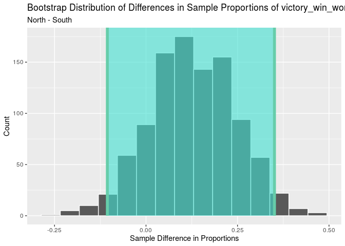<!-- -->

Based on the output, we are 95% confident that the true difference in
proportions of teams that include “victory,” “win,” or “won,” in their
fight songs for northern vs. southern conferences (north - south) is
between -0.107 (-10.7%) and 0.362 (36.2%). Since 0 is included in our
interval, this aligns with what we found from our hypothesis test.

Next, let’s look at our second variable, `men`, which refers to whether
a fight song mentions male groups in its lyrics, to see whether there
exists a statistically significant relationship between the proportion
of teams for which `men` is “yes” for northern or southern conferences.
First, let’s find what the two proportions are:

``` r
fight_songs %>%
  count(region, men) %>%
  group_by(region) %>%
  mutate(prop_men = n/sum(n))
```

    ## # A tibble: 4 x 4
    ## # Groups:   region [2]
    ##   region men       n prop_men
    ##   <chr>  <chr> <int>    <dbl>
    ## 1 north  No       15    0.556
    ## 2 north  Yes      12    0.444
    ## 3 south  No       26    0.684
    ## 4 south  Yes      12    0.316

Based on the output, 44.4% of schools in northern conferences mention
male groups in their fight songs. On the other hand, only 31.6% of
schools in southern conferences mention male groups in their fight
songs. We would like to see if this result is statistically significant
and what the true difference in proportions is. We have to use
simulation-based hypothesis testing because we are looking for the
difference in proportions.

First, we will run a hypothesis test, calculate the p-value, and
interpret the results in order to determine whether there is a
statistically significant difference in the proportion of fight songs
that mention male groups for schools in northern vs. southern
conferences. Our null hypothesis is that there is no difference in the
proportion of schools that mention men in their fight songs for southern
and northern conferences, H0: p(southern) = p(northern). Our alternative
hypothesis is that there is a difference in the proportion of schools
that mention men in their fight songs for southern and northern
conferences, Ha: p(southern) ≠ p(northern). We will use a significance
level of 0.05.

``` r
obs_diff_props_n_s_men <- 0.4444444 - 0.3157895 # From above code chunk

set.seed(11101962)
null_dist_north_south_men <- fight_songs %>%
  specify(response = men, explanatory = region, success = "Yes") %>%
  hypothesize(null = "independence") %>% 
  generate(reps = 1000, type = "permute") %>%
  calculate(stat = "diff in props", order = c("north", "south"))

get_p_value(null_dist_north_south_men, obs_stat = obs_diff_props_n_s_men, direction = "two_sided")
```

    ## # A tibble: 1 x 1
    ##   p_value
    ##     <dbl>
    ## 1   0.454

``` r
visualise(null_dist_north_south_men) + 
  labs(title = "Null Distribution for Difference in Proportions of Fight Songs that Mention Male Groups",
       subtitle = "For colleges located in the north and south",
       x = "Sample Difference in Proportions",
       y = "Count") +
  shade_p_value(obs_stat = obs_diff_props_n_s_men, direction = "two_sided")
```

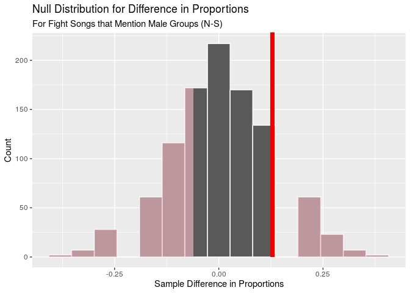<!-- -->

Based on our p-value of 0.454, which is greater than our significance
level of 0.05, we fail to reject the null hypothesis. There is
insufficient evidence that there is a difference in the proportion of
fight songs that mention male groups for southern and northern
conferences.

However, we did observe that northern conferences had a greater
proportion of teams with fight songs for which `men` was “yes.”
Therefore, let’s create a confidence interval to find what the true
difference in proportions really is:

``` r
set.seed(10081999)
boot_men <- fight_songs %>%
  specify(response = men, explanatory = region, success = "Yes") %>%
  generate(reps = 1000, type = "bootstrap") %>%
  calculate(stat = "diff in props", order = c("north", "south"))

CI <- get_ci(boot_men, .95)
CI
```

    ## # A tibble: 1 x 2
    ##   `2.5%` `97.5%`
    ##    <dbl>   <dbl>
    ## 1 -0.123   0.365

``` r
visualise(boot_men) +
  labs(title = "Bootstrap Distribution of Differences in Sample Proportions for men", 
          subtitle = "North - South", 
          x = "Sample Difference in Proportions", y = "Count") +
  shade_ci(CI)
```

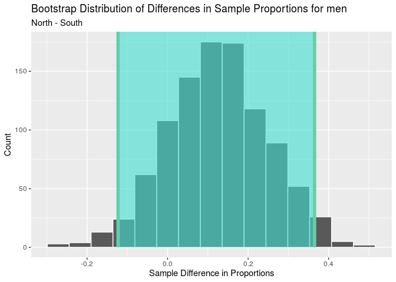<!-- -->

Based on the output, we are 95% confident that the true difference in
proportions of teams that mention male groups in their fight songs for
northern vs. southern conferences (north - south) is between -0.123
(-12.3%) and 0.365 (36.5%). Since 0 is included in our interval, this
aligns with what we found from our hypothesis test.

Finally, let’s look at our last variable, `nonsense`, which refers to
whether a fight song uses nonsense syllables in its lyrics, to see
whether there exists a statistically significant relationship between
the proportion of teams for which `nonsense` is “yes” for northern or
southern conferences. First, let’s find what the two proportions are:

``` r
fight_songs %>%
  count(region, nonsense) %>%
  group_by(region) %>%
  mutate(prop_nonsense = n/sum(n))
```

    ## # A tibble: 4 x 4
    ## # Groups:   region [2]
    ##   region nonsense     n prop_nonsense
    ##   <chr>  <chr>    <int>         <dbl>
    ## 1 north  No          23         0.852
    ## 2 north  Yes          4         0.148
    ## 3 south  No          32         0.842
    ## 4 south  Yes          6         0.158

Based on the output, 14.8% of schools in northern conferences use
nonsense syllables in their fight songs. On the other hand, 15.8% of
schools in southern conferences use nonsense syllables in their fight
songs. We would like to see if this result is statistically significant
and what the true difference in proportions is. We have to use
simulation-based hypothesis testing because we are looking for the
difference in proportions.

First, we will run a hypothesis test, calculate the p-value, and
interpret the results in order to determine whether there is a
statistically significant difference in the proportion of fight songs
that use nonsense syllables for schools in northern vs. southern
conferences. Our null hypothesis is that there is no difference in the
proportion of schools that use nonsense syllables in their fight songs
for southern and northern conferences, H0: p(southern) = p(northern).
Our alternative hypothesis is that there is a difference in the
proportion of schools that mention men in their fight songs for southern
and northern conferences, Ha: p(southern) ≠ p(northern). We will use a
significance level of
0.05.

``` r
obs_diff_props_n_s_nonsense <- 0.1481481    - 0.1578947 # From above code chunk

set.seed(11101962)
null_dist_north_south_nonsense <- fight_songs %>%
  specify(response = nonsense, explanatory = region, success = "Yes") %>%
  hypothesize(null = "independence") %>% 
  generate(reps = 1000, type = "permute") %>%
  calculate(stat = "diff in props", order = c("north", "south"))

get_p_value(null_dist_north_south_nonsense, obs_stat = obs_diff_props_n_s_nonsense, direction = "both")
```

    ## # A tibble: 1 x 1
    ##   p_value
    ##     <dbl>
    ## 1   0.648

``` r
visualise(null_dist_north_south_nonsense) + 
  labs(title = "Null Distribution for Difference in Proportions of Fight Songs that Use Nonsense Syllables",
       subtitle = "For colleges located in the north and south",
       x = "Sample Difference in Proportions",
       y = "Count") +
  shade_p_value(obs_stat = obs_diff_props_n_s_nonsense, direction = "two_sided")
```

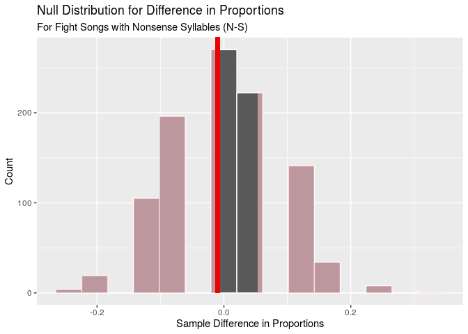<!-- -->

Based on our p-value of 0.648, which is greater than our significance
level of 0.05, we fail to reject the null hypothesis. There is
insufficient evidence that there is a difference in the proportion of
fight songs that use nonsense syllables for southern and northern
conferences.

However, we did observe that southern conferences had a greater
proportion of teams with fight songs for which `nonsense` was “yes.”
Therefore, let’s create a confidence interval to find what the true
difference in proportions really is:

``` r
set.seed(11101962)
boot_nonsense <- fight_songs %>%
  specify(response = nonsense, explanatory = region, success = "Yes") %>%
  generate(reps = 1000, type = "bootstrap") %>%
  calculate(stat = "diff in props", order = c("north", "south"))

CI <- get_ci(boot_nonsense, .95)
CI
```

    ## # A tibble: 1 x 2
    ##   `2.5%` `97.5%`
    ##    <dbl>   <dbl>
    ## 1 -0.192   0.160

``` r
visualise(boot_nonsense) +
  labs(title = "Bootstrap Distribution of Differences in Sample Proportions for nonsense", 
          subtitle = "North - South", 
          x = "Sample Difference in Proportions", y = "Count") +
  shade_ci(CI)
```

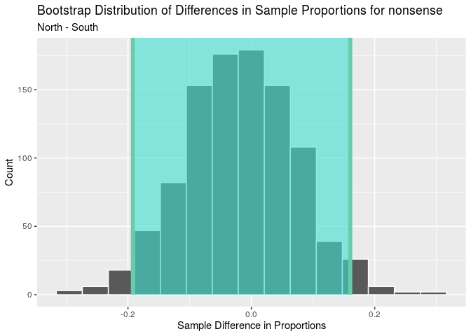<!-- -->

Based on the output, we are 95% confident that the true difference in
proportions of teams that mention male individuals/groups in their fight
songs for northern vs. southern conferences (`north` - `south`) is
between -0.193 (-19.3%) and 0.159 (15.9%). Since 0 is included in our
confidence interval, this aligns with what we found from our hypothesis
test.

Based on the hypothesis testing above, it turns out that the variables
`victory_win_won`, `men`, and `nonsense` are NOT regionally unique. In
other words, knowing whether a school is in a southern vs. northern
conference does not tell us whether that school’s fight song is more or
less likely to include the words “victory”, “win”, or “won”, mention
male individuals/groups, or use nonsense words/phrases. The data leads
us to believe that college fight songs are truly independent and random
from one another.
