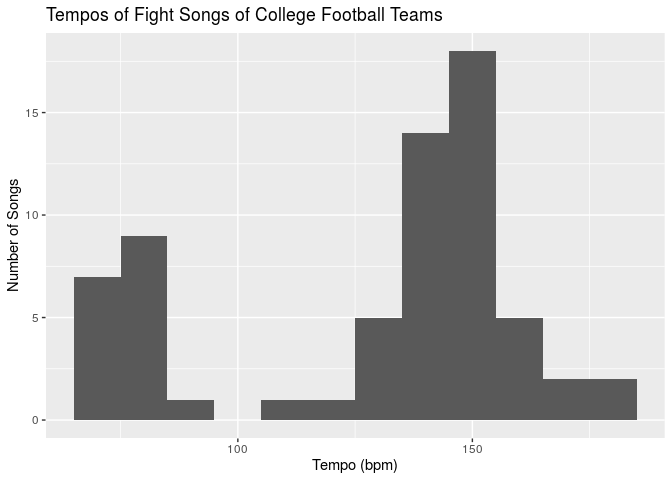
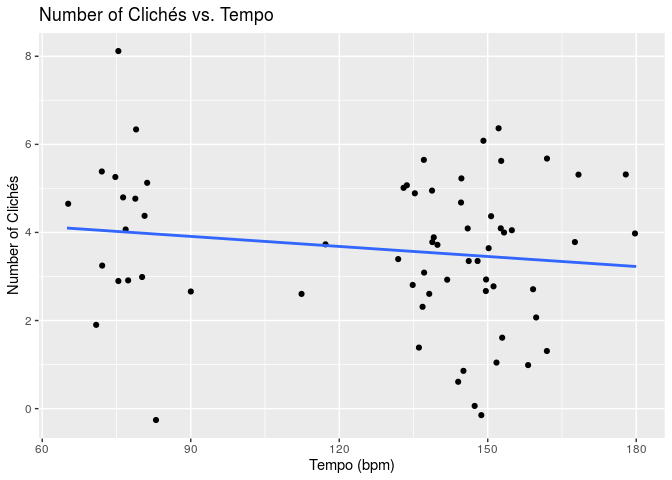
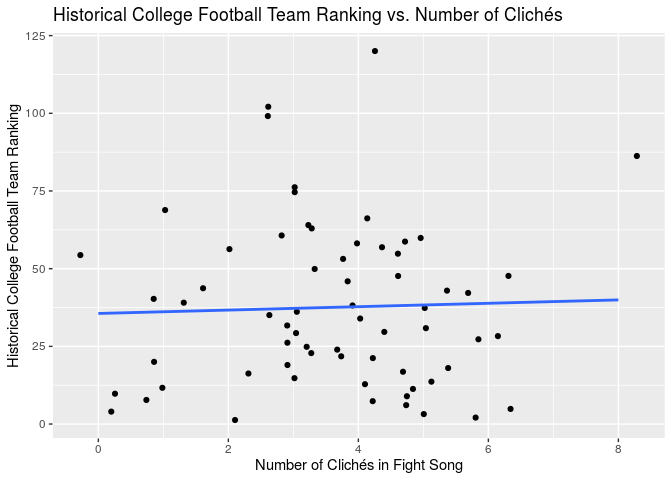

Analyzing College Fight Songs
================
Power Ninja Data Turtles
10/25/19

### Section 1: Introduction

In our research project, we will be analyzing the fight songs of various
college football teams to discover whether a song’s tempo or duration
can tell us anything about the content of the song and whether a team’s
fight song is indicative of their college football program’s success.
More specifically, we will be examining the fight songs of all 65 teams
located across the Power 5 sports conferences (Big 10, Big 12, ACC,
Pac-12 and SEC) plus Notre Dame (Independent conference). Hence, our
dataset, which is fittingly titled `fight-songs`, includes 65
observations. Each observation in the set represents a distinct Power 5
college football team (or Notre Dame). For each team (observation), the
original dataset featured 23 variables. However, we plan to use 19 of
these variables, plus one of our own, for a total of 20. The variables
primarily contain information regarding the school’s fight song, as well
as a couple of characteristics of the college football teams themselves
(i.e. which conference they belong to).

The variables are as follows: `school`, `conference`, `song_name`,
`writers`, `year`, `student_writer`, `official_song`, `bpm`,
`sec_duration`, `fight`, `number_fights`, `victory_win_won`, `rah`,
`nonsense`, `colors`, `men`, `opponents`, `spelling`, `trope_count`, and
finally, `rank`. Detailed explanations of each variable are located in
the codebook.

The data was collected by looking at the lyrics of each song (as
published by each individual college), metadata about each fight song on
Spotify, history about each song (as stated by the college), and
information about each school’s conference, which is easily accessible
on the Internet. We added the `rank` variable to the dataset using
Microsoft Excel, and we found this information from the Associated
Press’s historic rankings of every college football team in the
country, which was released last year.

As as note, some schools may have more than one fight song, and some of
the songs sanctioned as “official” by their schools are not the ones
that fans most commonly chant. The songs that seemed best-known and
best-loved were chosen as the “official” fight song. Additionally,
fivethirtyeight has tailored the lyrics of certain fight songs to those
sung most regularly and published by the school. Thus, some verses will
not appear (and hence will not be considered in our analysis).

### Section 2: Exploratory Data Analysis

We are interested in figuring out whether a team’s tempo (measured in
bpm, or beats per minute) has anything to do with the number of clichés
that a song has. First, we will create a histogram and calculate the
summary statistics to visualize the distribution of tempos across fight
songs for all teams in our dataset:

``` r
ggplot(data = fight_songs, mapping = aes(x = bpm)) + 
  geom_histogram(binwidth = 10) + 
  labs(x = "Tempo (bpm)", y = "Number of Songs", title = "Tempos of Fight Songs of College Football Teams")
```

<!-- -->

Let’s also calculate the summary statistics for this distribution.
Specifically, we will use the median as a measure of center and the
interquartile range as a measure of spread (due to the bimodal nature of
the distribution). In addition, we will find the upper and lower
quartiles (Q3 and Q1 respectively), and the maximum and minimum values:

``` r
fight_songs %>%
  summarise(median = median(bpm), 
            IQR = IQR(bpm), 
            Q1 = quantile(bpm, 0.25), 
            Q3 = quantile(bpm, 0.75), 
            min = min(bpm), 
            max = max(bpm))
```

    ## # A tibble: 1 x 6
    ##   median   IQR    Q1    Q3   min   max
    ##    <dbl> <dbl> <dbl> <dbl> <dbl> <dbl>
    ## 1    140    61    90   151    65   180

Based on the histogram, it is clear that the shape of the data is
clearly bimodal, with two distinct peaks occurring around 40 bpm and
around 150 bpm. There are more songs that are clustered around the
higher bpm mode. The center (median) occurs at 140 bpm, and the spread
(IQR) is 61 bpm, indicating that there is a moderate amount of
variability in tempos. There are no outliers in this distribution.

Now, let’s see whether there appears to be a relationship between a
fight song’s tempo (bpm) and the number of clichés (tropes) that a song
has. We will do this by creating a scatterplot and fitting a linear
model:

``` r
ggplot(data = fight_songs, mapping = aes(x = bpm, y = trope_count)) +
  geom_jitter() +
  geom_smooth(method = "lm", se = FALSE) +
  labs(x = "Tempo (bpm)", y = "Number of Clichés", title = "Number of Clichés vs. Tempo")
```

<!-- -->

There seems to be a weak, negative linear relationship between tempo and
number of clichés. Let’s find the linear model associated with this
scatterplot:

``` r
(m_bpm <- lm(data = fight_songs, trope_count ~ bpm)) %>%
  tidy() %>%
  select(term, estimate)
```

    ## # A tibble: 2 x 2
    ##   term        estimate
    ##   <chr>          <dbl>
    ## 1 (Intercept)  4.59   
    ## 2 bpm         -0.00759

Based on the output, the linear model that predicts number of tropes
based on tempo is: trope\_count-hat = 4.59 - 0.00759 \* bpm. The
intercept tells us that if a song has 0 bpm (nonsensical), it is
expected to have 4.59 clichés (tropes), on average. The slope tells us
that for an increase in 1 bpm, the expected number of clichés is
predicted, on average, to decrease by 0.00759. The R-squared value of
this model is 0.0225985, meaning that approximately 2.2598527 percent of
the variability in clichés is accounted for by the linear model. This
means that the linear model is relatively weak since, the closer the R
squared value is to 1 (or 100% variability), the more accurate the model
is.

Now, let’s see whether `trope_count` is related as to the `rank`
(success) of a team. We will do this by creating another scatterplot and
fitting a model:

``` r
ggplot(data = fight_songs, mapping = aes(x = trope_count, y = rank)) +
  geom_jitter() +
  geom_smooth(method = "lm", se = FALSE) +
  labs(x = "Number of Clichés in Fight Song", y = "Historical College Football Team Ranking", title = "Historical College Football Team Ranking vs. Number of Clichés")
```

<!-- -->

There seems to be a weak positive linear relationship between number of
clichés in a fight song and the historical ranking of a college football
team. Let’s find the linear model associated with this scatterplot:

``` r
(m_tropes_rank <- lm(data = fight_songs, rank ~ trope_count)) %>%
  tidy() %>%
  select(term, estimate)
```

    ## # A tibble: 2 x 2
    ##   term        estimate
    ##   <chr>          <dbl>
    ## 1 (Intercept)   35.6  
    ## 2 trope_count    0.545

Based on the output, the linear model that predicts rank based on number
of clichés is: rank-hat = 35.6 + 0.545 \* trope\_count. The intercept
tells us that if a song has 0 clichés, it is expected to have a ranking
of 35.6, on average. The slope tells us that for an increase in 1
cliché, the historical college football team ranking is predicted, on
average, to increase by 0.545 points. The R-squared value of this model
is 0.0012119, meaning that approximately 0.1211865 percent of the
variability in ranks is accounted for by the linear model. This means
that the linear model is extremely weak since, the closer the R squared
value is to 1 (or 100% variability), the more accurate the model is.

### Section 3: Research Questions

Our first research question is: how does the tempo and duration of a
college football team’s fight song predict the content of the song
(i.e. the number of clichés/tropes)? We will utilize the `trope_count`
variable, which counts the number of clichés in a fight song (since we
define a cliché as whether a song contains the word “fight”, the word
“victory”, the word “won”, the word “win”, the word “rah”, nonsense
syllables, school colors, a reference to “men”/“boys”/“sons”, an
opponent name, or spells something out), to form connections between a
song’s duration and tempo and its content. The predictor variables we
are interested in are: `bpm`, which we started to explore in Section 2,
and `sec_duration`. We aim to describe the relationship, if any exists,
between the two numerical predictor (X) variables and the numerical
response (Y) variable, `trope_count`. Based on the exploratory data
analysis from Section 2, we hypothesize that the number of clichés will
be less for songs with slower tempos (smaller `bpm`) and probably
shorter durations (smaller `sec_duration`). Combining tempo and
duration, we hope to separate songs into 4 categories, “short and fast,”
“short and slow”, “long and fast,” and “long and slow”, and thus compare
the number of tropes across these four categories.

Our second research question is: how do characteristics of fight songs
of college football teams correspond to their respective historical
levels of success? We will utilize the `rank` variable to form
connections between the performances of college football teams and their
respective fight songs. The predictor variables we are interested in
are: `victory_win_won`, `opponents`, `nonsense`, and `rah`. We aim to
describe the relationship, if any exists, between these four categorical
predictor (X) variables and the numerical response (Y) variable, `rank`.
We hypothesize that a statistically significant relationship exists
between `victory_win_won` and `rank` because it is reasonable to asssume
historically successful college football teams would incorporate
symbolic elements of their dominance into their iconic fight songs. In
this case, we believe the words “victory”, “win”, and “won” are symbolic
elements of dominance, giving us reason to believe higher-ranked teams
are more likely to have their fights songs include these words. We also
hypothesize that a statistically significant relationship exists between
`opponents` and `rank` since higher-ranked college football teams are
likely to have developed more emotionally-charged rivalries with their
highly successful peers. With such long-standing, emotional rivalries,
it is reasonable to believe fight songs associated with these
highly-ranked college football programs allude to these rivals by name.
Moreover, we hypothesize that a statistically significant relationship
exists between `nonsense` and `rank` because there have been a plethora
of articles written about how, in the past, highly successful teams
included nonsensical phrases in their fight songs to distract the
players on the opposing college football teams. Since the fight songs
included in our dataset were written decades ago (as evidenced by the
`year` variable), it is reasonable to assume the songs associated with
the historically-best college teams will have a higher likelihood of
including nonsense (e.g “Hooperay”). Finally, we hypothesize there is no
statistically significant relationship between `rah` and `rank` since
“rah” seems like it would be a common word in a fight song,
irrespective of the quality (how successful) of a college football team.

### Section 4: Data

Below, we use the glimpse() function to display a preview of the dataset
`fight_songs`:

``` r
glimpse(fight_songs)
```

    ## Observations: 65
    ## Variables: 20
    ## $ school          <chr> "Notre Dame", "Baylor", "Iowa State", "Kansas", …
    ## $ conference      <chr> "Independent", "Big 12", "Big 12", "Big 12", "Bi…
    ## $ song_name       <chr> "Victory March", "Old Fight", "Iowa State Fights…
    ## $ writers         <chr> "Michael J. Shea and John F. Shea", "Dick Baker …
    ## $ year            <chr> "1908", "1947", "1930", "1912", "1927", "1905", …
    ## $ student_writer  <chr> "No", "Yes", "Yes", "Yes", "Yes", "Yes", "No", "…
    ## $ official_song   <chr> "Yes", "Yes", "Yes", "Yes", "Yes", "Yes", "Yes",…
    ## $ bpm             <dbl> 152, 76, 155, 137, 80, 153, 180, 81, 149, 159, 1…
    ## $ sec_duration    <dbl> 64, 99, 55, 62, 67, 37, 29, 65, 47, 54, 92, 60, …
    ## $ fight           <chr> "Yes", "Yes", "Yes", "No", "Yes", "No", "Yes", "…
    ## $ number_fights   <dbl> 1, 4, 5, 0, 6, 0, 5, 17, 2, 8, 0, 0, 1, 9, 8, 0,…
    ## $ victory_win_won <chr> "Yes", "Yes", "No", "No", "Yes", "No", "Yes", "Y…
    ## $ rah             <chr> "Yes", "No", "Yes", "No", "No", "Yes", "No", "No…
    ## $ nonsense        <chr> "No", "No", "No", "Yes", "No", "No", "No", "No",…
    ## $ colors          <chr> "Yes", "Yes", "No", "No", "Yes", "No", "No", "Ye…
    ## $ men             <chr> "Yes", "No", "Yes", "Yes", "No", "No", "Yes", "N…
    ## $ opponents       <chr> "No", "No", "No", "Yes", "No", "No", "Yes", "Yes…
    ## $ spelling        <chr> "No", "Yes", "Yes", "No", "No", "Yes", "No", "No…
    ## $ trope_count     <dbl> 6, 5, 4, 3, 3, 2, 4, 4, 6, 3, 1, 6, 3, 3, 3, 0, …
    ## $ rank            <dbl> 5, 48, 120, 64, 50, 1, 46, 7, 28, 63, 40, 48, 76…
